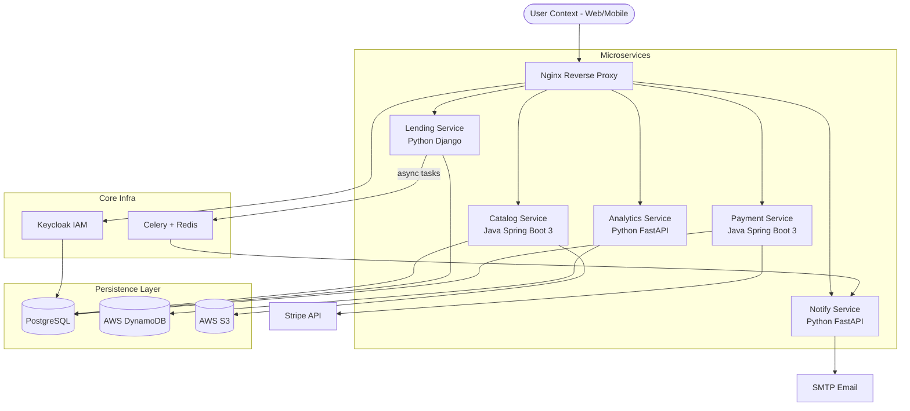
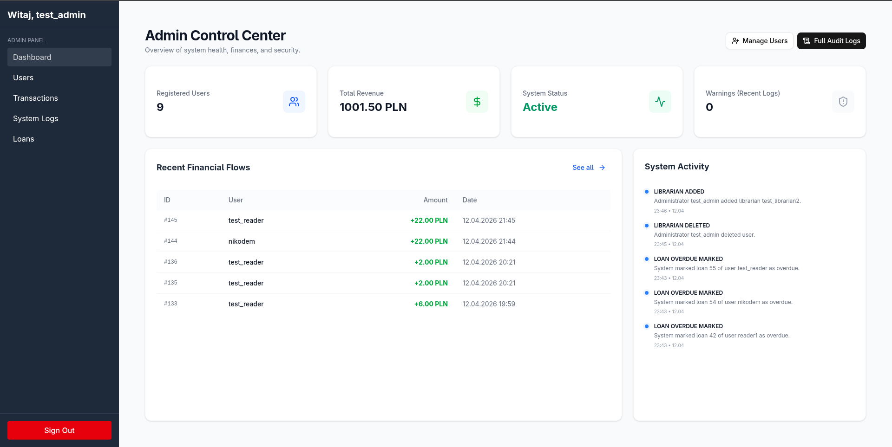
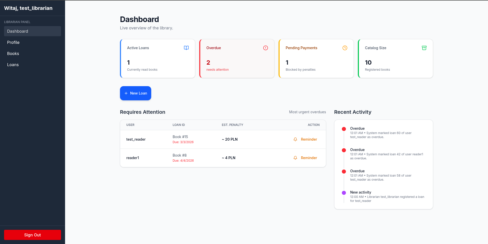

# Polyglot Microservices Library Management System

A production-ready, highly scalable library management system engineered with a polyglot microservice architecture. It features asymmetric JWT-based authentication, an externalized and environment-agnostic configuration system, and asynchronous task management.

## 📚 Documentation
- [⚙️ Architecture & Design](./docs/architecture.md)
- [🔒 Security Considerations](./docs/security.md)
- [💻 Installation Guide](./docs/installation.md)

## 🏗 Architecture

## 🛠 Tech Stack

    
   
    

## ✨ Key Features
- **Asymmetric JWT Authentication**: Secure identity distribution via Keycloak utilizing RS256 signatures and strict realm validation.
- **Asynchronous Penalty Processing**: Real-time evaluation of book overdues leveraging Django, Celery, and Redis for distributed background processing.
- **Polyglot Persistence**: Separation of heavily transactional state into unified PostgreSQL, whilst channeling high-throughput write-heavy log interactions into AWS DynamoDB.

## 📸 Application Preview

### 💻 Web Interface (Librarians & Admins)
**Admin Control Center** 

**Librarian Management Dashboard** 

### 📱 Mobile Experience (Readers)
**Book Discovery & Lending** 

**Integrated Stripe Payments** 

## 🚀 Technical Challenges & Solutions

**Challenge 1: Cross-device JWT Validation (Local IP vs Localhost)**
- **Context:** When developing mobile apps against a local stack, authentication issuer strings (`iss`) differed dynamically—mobile bridged through `192.168.x.x` while web resolved `localhost`. This led to token validation failures for the mobile client.
- **Solution:** Engineered a Custom Flexible Issuer Validator across Spring Boot and Python contexts. The logic safely validates only the strict realm suffix structure, while enforcing mathematically rigorous RSA signature verification directly using our internal Keycloak JWKS endpoints.

**Challenge 2: Environment Portability**
- **Context:** Legacy references and rigid configurations were causing massive friction between dev, staging, and prod deployment cycles.
- **Solution:** Extracted 100% of hardcoded URLs into an environment dictionary (`.env`) leveraging Docker Compose interpolation. This yielded an isolated application state resilient to physical host shifting.