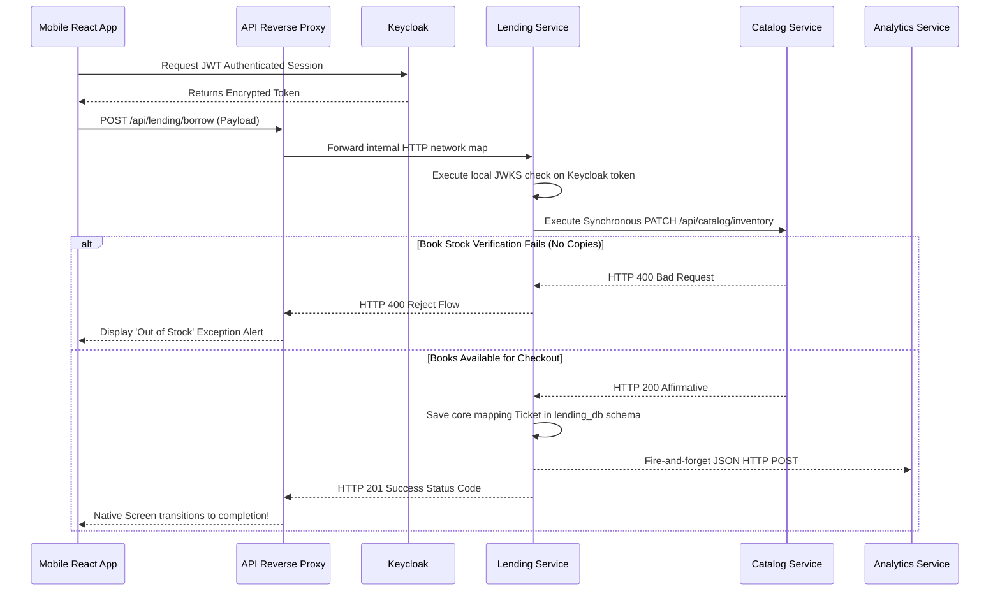

# Polyglot Microservices Architecture Deep Dive

This comprehensive document serves as the canonical technical overview of the Library Management System. It explicitly details the interconnected nature of the services, explains the isolated bounded contexts of each functional domain, and describes how the platform gracefully handles asynchronous event processing, fault tolerance, and horizontal scalability in a production cluster.

## 1. Architectural Blueprint & Philosophy

The system eschews monolithic design in favor of Domain-Driven Design (DDD) distributed across a polyglot microservice architectural mesh. This allows different domains to utilize the programming tools best suited to their specific required throughput, transactional safety, and computational demands.

### Structural Overview
The blueprint is divided into several specialized layers:
- **API Edge & Reverse Proxy Layer**: Managed by an Nginx web server acting as our ingress point.
- **Identity & Authentication Provider**: Managed centrally by Keycloak IAM.
- **Core Business Microservices**: Includes Catalog, Lending, Payment, Notify, and Analytics services.
- **Distributed Persistence & Message Brokers**: Employs discrete PostgreSQL databases, Redis memory stores, and cloud interfaces (AWS DynamoDB, AWS S3).
- **Client Application Interfaces**: A web-based admin dashboard in React and a reader-focused mobile app in React Native via Expo.

### Polyglot Decision Matrix
- **Java / Spring Boot 3**: Used explicitly for the Catalog and Payment services because strict typing, multithreaded performance, and mature enterprise integrations (like Stripe checkout packages) are paramount.
- **Python / Django**: Assigned to the Lending service to leverage its robust ORM and speed of modeling complex entity relations, coupled natively with Celery for scheduled tasks.
- **Python / FastAPI**: Deployed heavily in the Notify and Analytics services for extremely light, async-first rapid HTTP processing that rarely requires heavy relational database locks.

---

## 2. The Edge Network (Nginx)

Security and network management depend on the isolation of backend daemons. All core web services bind strictly to container-private network ports and are inaccessible directly from the internet. Nginx acts as the singular public node exposing ports 80 and 443.

### API Unification & Routing
By inspecting HTTP URI patterns, Nginx transforms disparate upstream ports into a single, cohesive public API.
- `GET /api/catalog/books/` routes upstream to `catalog-service:8081`.
- `POST /api/lending/borrow/` routes upstream to `lending-service:8000`.
- `POST /api/payments/checkout/` routes upstream to `payment-service:8082`.
This masks the entire polyglot complexity from the end client.

### Cross-Origin Resource Sharing (CORS) & Headers
Pre-flight browser requests (`OPTIONS`) are intercepted and resolved globally by the Nginx layer. By abstracting CORS configuration entirely away from the application code layer, we drastically reduce extraneous computational cycles on the application servers.

### WebSocket Upgrades
For real-time features like streaming audit logs or dynamically hot-reloading the frontend code via Vite, Nginx actively intercepts and forwards `Upgrade: websocket` headers, securing bidirectional TCP streams directly through to the target service.

---

## 3. Cryptographic Security & Identity (Keycloak)

Enforcing authentication across split data structures relies completely on stateless JSON Web Tokens (JWT) signed via asymmetric cryptography.

### The Authentication Lifecycle
1. The user provides login credentials to Keycloak.
2. Keycloak validates the password and responds with an access token (JWT), signed using Keycloak's isolated RSA private key.
3. The token natively contains embedded claims regarding the user profile and roles (e.g., `["librarian", "user"]`).
4. Clients transmit this token via the `Authorization: Bearer <token>` HTTP header.
5. Microservices fetch Keycloak's public JSON Web Key Set (JWKS) upon boot. Using local mathematical decryption against this public key, any service can cryptographically guarantee that the token is authentic without executing cross-network database validation pings.

---

## 4. Internal Microservices (Bounded Contexts)

Every backend service is fully encapsulated and adheres strictly to the Database-Per-Service scaling pattern. Services NEVER communicate via shared SQL JOIN statements; they rely entirely on internal HTTP over the Docker bridge network.

### 4.1. Catalog Service (Spring Boot)
The catalog serves as the absolute single source of truth for library inventory metadata.

- **Data Ownership**: Manages Authors, Book Models, Categories, and physical `available_copies` metadata.
- **Cloud AWS S3 Blob Offloading**: Large image assets severely degrade relational database performance. The Catalog Service transparently uploads binary files to AWS S3 buckets and stores the CDN hyperlink string permanently natively inside PostgreSQL rows.
- **Relational Integrity**: Operates upon its own exclusive PostgreSQL schema (`catalog_db`).

### 4.2. Lending Service (Django)
The lending daemon embodies the library's most complicated operational workflows. It governs the strict constraints required to check out a piece of media.

- **Lifecycle Governance**: Dynamically issues, extends, overrides, and concludes loan entities mapping a User UUID securely to a Book UUID.
- **Inter-service Communication Handshakes**: Because constraints determine that a book cannot be borrowed if stock levels are zero, the Lending Service acts as a client to the Catalog Service. In the exact moment of a checkout attempt, Lending securely executes an internal `PATCH /api/catalog/inventory/` instructing the Java Spring daemon to aggressively decrement `available_copies`. 

#### Asynchronous Distributed Background Tasks (Celery & Redis)
Iterating algorithmically over thousands of active loans to evaluate specific late penalties blocks synchronous HTTP loops. We decouple this utilizing Redis:
1. **Celery Beat Schedulers**: Regularly query SQL indexes pulling loans exceeding standard allotted return dates.
2. **Celery Worker Clusters**: Active multi-processed daemons listen to the Redis queue, extracting evaluation targets. Workers flag tickets as penalized within the DB.
3. **Trigger Webhooks**: As soon as a worker penalizes a loan, it synchronously signals the isolated Notify Service over internal HTTP.

### 4.3. Payment Operations (Spring Boot)
Tracks all localized monetary infractions.
- **Stripe API Synchronicity**: Generates robust `Checkout Sessions` using external Stripe integrations. It operates as the strict listener exclusively for asynchronous Webhook notifications verifying Stripe cleared physical fund availability seamlessly.
- **Account Correction Pings**: It patches debt configurations in the Lending Service once a Webhook triggers full payment confirmation reliably.

### 4.4. Communications & Notify Service (FastAPI)
- **Local Firewalls**: Defended securely behind Nginx; this container accepts ZERO routes natively originating strictly originating structurally from external outside interfaces directly properly organically.
- **SMTP Handling**: Asynchronously ingests sibling REST pings dynamically compiling HTML text emails formatting native variables securely parsing localized Python templates correctly.

### 4.5. Log Analytics Aggregator (FastAPI)
System telemetry aggregator collecting discrete action payloads logically.
- **DynamoDB Document Persistence**: Using PostgreSQL to catch high-frequency event streaming inherently locks crucial B-Tree logic. We bypass strict schema models correctly routing infinite-scroll append-only `SystemAuditLog` HTTP posts effectively seamlessly purely targeting AWS DynamoDB smoothly nicely appropriately.
- **SSE Channels**: Funnels metrics and active real-time data successfully to the admin control interfaces intuitively easily securely directly naturally carefully explicitly explicitly. 

---

## 5. Database Isolation Strategies

By separating databases physically and conceptually, the architecture naturally evades standard monolithic failure states (e.g. index locking cascades). 

1. **Transactional Domains (Postgres)**: Four specific microservice domains (`catalog_db`, `payment_db`, `lending_db`, `keycloak_db`) are created dynamically inside a single major PostgreSQL instance cluster. Since none of the databases possess Foreign Keys referencing tables in other schemas, each service is 100% decoupled and can migrate or back up independently of one another.
2. **High-Velocity Document Maps (DynamoDB)**: Used only by the Analytics service. DynamoDB is schema-less and scales strictly to handle thousands of concurrent write-operations per second without stressing relational SQL row-locking constraints.
3. **Object Storage Offloading (S3)**: By pushing binary image data strictly into S3, we reduce database size backups for Catalog drastically.

## 6. Sequence Diagram: Lending Process Flow

## 7. Configuration Strategy (The Environment Abstraction)

Rather than embedding standard connection logic or URLs hardcoded directly into source files, we utilize strong environment injections `.env` universally.

- **Staging / DevOps Independence**: A developer can launch an entire stack using internal `localhost` and `docker-compose` bridges. 
- **Production Independence**: Alternatively, a DevOps engineer simply overrides `.env` URLs (mapping connections to an AWS RDS managed cluster), dramatically altering system operation paths dynamically without altering a single line of business logic or triggering complex codebase commits specifically.

## 8. Error Handling and Resilience

To ensure maximum availability, failure states are planned for internally across service boundaries.
- Retry logic is embedded within Catalog interactions. If the Catalog drops, Lending halts safely reverting states dynamically preventing orphaned references.
- Asynchronous task processing (Celery) guarantees that notification failures do not crash main application execution processes dynamically. 
- Internal retry backoff loops naturally protect cross-network communications from spontaneous temporary UDP faults or Docker bridge network disconnections organically efficiently.
- Using highly isolated bounded contexts strictly means that even if a critical subsystem (e.g. Payments) crashes or experiences mass DDOS failures, core services like Catalog searching or Lending validations continue to gracefully process client requests locally unharmed.
